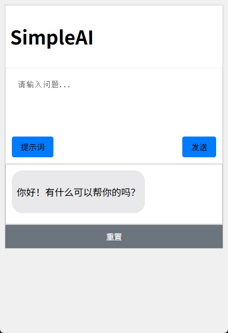

<p align="right">
  <a href="./README_EN.md">English</a> | <b>简体中文</b>
</p>

# SimpleAI


**你是否在为遇到一些小问题又不想浪费调用次数而烦恼？你是否遇到一些简单的问题而不想打开网页而忧心？👉simpleAI来了~**

这是一个基于 `pywebview` 和 `langchain` 构建的极简跨平台桌面AI应用,目的是用户可以在桌面快速利用快捷键调出桌面进行对话，且本应用预设了多个专业prompt，极度提高用户的对话体验。


## 📖 目录

- [SimpleAI](#simpleai)
  - [📖 目录](#-目录)
  - [🚀 功能特性](#-功能特性)
  - [应用展示](#应用展示)
  - [🛠️ 技术栈](#️-技术栈)
  - [🏃 如何运行](#-如何运行)
  - [📖 使用指南](#-使用指南)
  - [📁 文件结构](#-文件结构)
  - [更新](#更新)

## 🚀 功能特性

- **后台常驻运行**: 应用在后台静默运行，不打扰您的工作流程。
- **全局快捷键唤醒**: 随时随地通过自定义快捷键 (`Ctrl+Shift+A` 为默认) 召唤或隐藏主窗口。
- **系统托盘管理**:
    - 应用图标会显示在系统托盘区，方便管理。
    - 右键菜单提供“显示/隐藏”、“设置”、“退出”等核心操作。
- **窗口置顶**: 主窗口总是在所有其他窗口之上，方便快速参考和交互。
- **高度可配置**:
    - **API 设置**: 自由配置您的大语言模型名称、API Key 和 API Base URL。
    - **快捷键设置**: 动态修改全局唤醒快捷键，无需重启。
    - **提示词管理**: 在设置界面中，可以轻松**添加**、**编辑**和**删除**自定义的AI角色（Prompts）。
- **持久化聊天记录**: 对话历史会自动保存在本地的 `chat_history.db` (SQLite) 文件中，每个AI角色拥有独立的对话历史。


## 应用展示




## 🛠️ 技术栈

- **核心框架**:
    - `pywebview`: 用于将Web内容包装成桌面应用，并建立Python与JavaScript之间的双向通信。
    - `langchain`: 强大的语言模型框架，用于构建、管理和调用AI模型。
- **后端**:
    - `Python`: 主要的后端逻辑语言。
    - `pystray` & `Pillow`: 实现系统托盘图标功能。
    - `keyboard`: 用于监听全局快捷键。
- **前端**:
    - `HTML` / `CSS` / `JavaScript`: 构建用户界面和交互逻辑。
- **数据库**:
    - `SQLite`: 轻量级的本地数据库，用于存储聊天历史。

## 🏃 如何运行

1.  **克隆项目**
    ```bash
    git clone https://github.com/Heyflyingpig/SimpleAI
    cd SimpleAI
    ```

2.  **安装依赖**
    项目依赖于一些Python库，你可以通过 `pip` 来安装它们：
    ```bash
    pip install -r requirements.txt
    ```

3.  **配置 (首次运行)**
    首次运行前，请检查项目根目录下的 `secrets.json` 和 `prompts.json`。
    - `secrets.json`: 填入您的 API Key 等信息。
    - `prompts.json`: 您可以在此预先修改或添加提示词。
    *如果文件不存在，程序首次运行时会自动创建默认版本。*

4.  **启动应用**
    一切准备就绪后，运行 `main.py` 即可启动应用：
    ```bash
    python main.py
    ```

## 📖 使用指南

1.  **主窗口**: 启动后出现的主窗口是您的主要AI对话界面。您可以按 `Ctrl+Enter` 发送消息。
2.  **隐藏/显示**: 点击窗口的关闭按钮或按快捷键，窗口会隐藏。再次按快捷键可重新显示。
3.  **系统托盘**: 在电脑右下角找到应用图标。右键点击可进行设置或退出应用。
4.  **设置**:
    - **API 设置**: 配置连接AI模型所需的信息。
    - **快捷键设置**: 点击输入框，然后按下您想设置的新快捷键组合，点击保存即可生效。
    - **提示词设置**:
        - 左侧是提示词列表，右侧是编辑区。
        - 点击列表中的项进行编辑。
        - 点击“清空表单”按钮可以进入新增模式。
        - 点击列表项右侧的“删除”按钮可删除自定义提示词（默认提示词无法删除）。

**注意**：如果您一开始没使用过该程序，一开始直接启动设置选项，需要修改api等相关设置，否则无法正常使用。

## 📁 文件结构

```
SimpleAI/
│
├── static/                   # 存放所有前端静态资源
│   ├── CSS/
│   │   ├── style.css         # 主窗口样式
│   │   └── setting.css       # 设置窗口样式
│   ├── JS/
│   │   ├── script.js         # 主窗口交互逻辑
│   │   ├── setting.js        # 设置窗口交互逻辑
│   │   └── marked.min.js     # Markdown渲染库
│   ├── img/
│   │   └── icon.png          # 系统托盘图标
│   ├── index.html            # 应用主页面
│   └── setting.html          # 设置页面
│
├── main.py                   # 应用主程序入口和后端逻辑
├── requirements.txt          # Python 依赖列表
├── secrets.json              # (自动生成/手动配置) 存储API密钥、快捷键等
├── prompts.json              # (自动生成/手动配置) 存储所有提示词
├── chat_history.db           # (自动生成) SQLite数据库文件
└── README.md                 # 项目说明文件
```

## 更新
---
0723更新
1. 更新提示词
2. 更新重置按钮逻辑,重置数据库内容
3. 更改css布局

---
0724更新
1. 新增系统托盘功能，新增托盘设置列表
2. 新增系统后台运行逻辑，快捷键调出功能
3. 新增窗口置顶功能
4. 绘制simpleAI的图标
5. 新增设置界面，重置布局
6. 新增API设置选项，包括：快捷键设置，提示词设置，关于布局
7. 新增API设置界面，可以自定义模型名称，API密匙，API地址了
8. 新增快捷键界面，可以自定义快捷键
9. 新增提示词设置，可以删除或者自定义快捷键了
10. 新增关于界面描述
11. 修复了默认提示词无法切换的问题
12. 修复了css中代码展示和超行问题
13. 增加清屏功能
---
0724更新
1. 发布v1.0.0版本