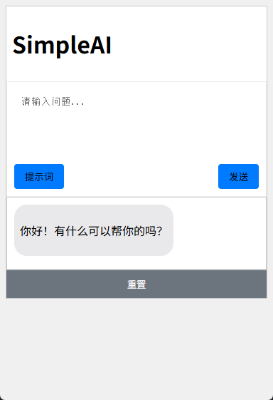
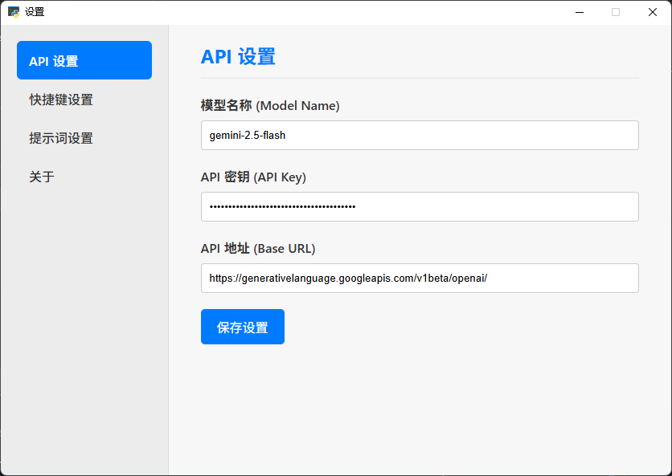

<p align="right">
  <b>English</b> | <a href="./README.md">简体中文</a>
</p>

# SimpleAI

**Are you tired of wasting API calls on small questions? Do you find it cumbersome to open a browser for simple queries? 👉 SimpleAI is here to help!**

This is a minimalist, cross-platform desktop AI application built with `pywebview` and `langchain`. It allows users to quickly summon a chat window with a hotkey for instant conversations. The application comes with pre-set professional prompts to greatly enhance the user's dialogue experience.


## 🚀 Features

- **Always-on Background Operation**: The application runs silently in the background without interrupting your workflow.
- **Global Hotkey Activation**: Summon or hide the main window from anywhere using a customizable hotkey (default is `Ctrl+Shift+A`).
- **System Tray Management**:
    - The application icon is available in the system tray for easy management.
    - The right-click context menu provides core actions like "Show/Hide," "Settings," and "Exit."
- **Always on Top**: The main window stays on top of all other windows for quick reference and interaction.
- **Highly Configurable**:
    - **API Settings**: Freely configure your Large Language Model name, API Key, and API Base URL.
    - **Hotkey Settings**: Change the global activation hotkey on the fly without restarting the application.
    - **Prompt Management**: Easily **add**, **edit**, and **delete** custom AI roles (Prompts) in the settings panel.
- **Persistent Chat History**: Conversation history is automatically saved locally in a `chat_history.db` (SQLite) file, with separate history for each AI role.


## Application Showcase





## 🛠️ Tech Stack

- **Core Frameworks**:
    - `pywebview`: Used to wrap web content into a desktop application and establish two-way communication between Python and JavaScript.
    - `langchain`: A powerful language model framework for building, managing, and calling AI models.
- **Backend**:
    - `Python`: The primary language for backend logic.
    - `pystray` & `Pillow`: For implementing the system tray icon functionality.
    - `keyboard`: For listening to global hotkeys.
- **Frontend**:
    - `HTML` / `CSS` / `JavaScript`: For building the user interface and interaction logic.
- **Database**:
    - `SQLite`: A lightweight local database for storing chat history.

## 🏃 How to Run

1.  **Clone the project**
    ```bash
    git clone https://github.com/Heyflyingpig/SimpleAI
    cd SimpleAI
    ```

2.  **Install dependencies**
    The project relies on several Python libraries, which you can install using `pip`:
    ```bash
    pip install -r requirements.txt
    ```

3.  **Configuration (First-time run)**
    Before running for the first time, check for `secrets.json` and `prompts.json` in the project's root directory.
    - `secrets.json`: Fill in your API Key and other related information.
    - `prompts.json`: You can pre-modify or add prompts here.
    *If these files do not exist, the application will create default versions on its first run.*

4.  **Start the application**
    Once everything is set up, run `main.py` to start the application:
    ```bash
    python main.py
    ```

## 📖 Usage Guide

1.  **Main Window**: The window that appears on launch is your main AI conversation interface. You can press `Ctrl+Enter` to send a message.
2.  **Hide/Show**: Click the close button or use the hotkey to hide the window. Use the hotkey again to bring it back.
3.  **System Tray**: Find the application icon in the system tray. Right-click it to access settings or exit the application.
4.  **Settings**:
    - **API Settings**: Configure the information needed to connect to your AI model.
    - **Hotkey Settings**: Click the input box, press your desired new key combination, and click "Save" to apply it.
    - **Prompt Settings**:
        - The list of prompts is on the left, and the editor is on the right.
        - Click an item in the list to edit it.
        - Click the "Clear Form" button to enter "add new" mode.
        - Click the "Delete" button next to a custom prompt to remove it (default prompts cannot be deleted).

**Note**: If you are using the application for the first time, you must open the settings and configure your API details, otherwise it will not work correctly.

## 📁 File Structure

```
SimpleAI/
│
├── static/                   # Contains all frontend static assets
│   ├── CSS/
│   │   ├── style.css         # Main window styles
│   │   └── setting.css       # Settings window styles
│   ├── JS/
│   │   ├── script.js         # Main window interaction logic
│   │   ├── setting.js        # Settings window interaction logic
│   │   └── marked.min.js     # Markdown rendering library
│   ├── img/
│   │   └── icon.png          # System tray icon
│   ├── index.html            # Main application page
│   └── setting.html          # Settings page
│
├── main.py                   # Main application entry point and backend logic
├── requirements.txt          # Python dependency list
├── secrets.json              # (Auto-generated/manual) Stores API keys, hotkeys, etc.
├── prompts.json              # (Auto-generated/manual) Stores all prompts
├── chat_history.db           # (Auto-generated) SQLite database file
└── README.md                 # Project documentation
```

## Updates
---
**Update 0723**
1. Updated prompts.
2. Updated reset button logic to reset database content.
3. Changed CSS layout.

---
**Update 0724**
1. Added system tray functionality with a settings menu.
2. Implemented background running logic and hotkey activation.
3. Added "always on top" feature for the window.
4. Designed a new icon for SimpleAI.
5. Created a new settings interface and redesigned the layout.
6. Added API settings section, including custom model name, API key, and API base URL.
7. Added a hotkey settings section for customizing the activation key.
8. Added a prompt management section to add or delete custom prompts.
9. Added an "About" section with a description.
10. Fixed an issue where default prompts could not be switched.
11. Fixed CSS issues with code block display and text overflow. 